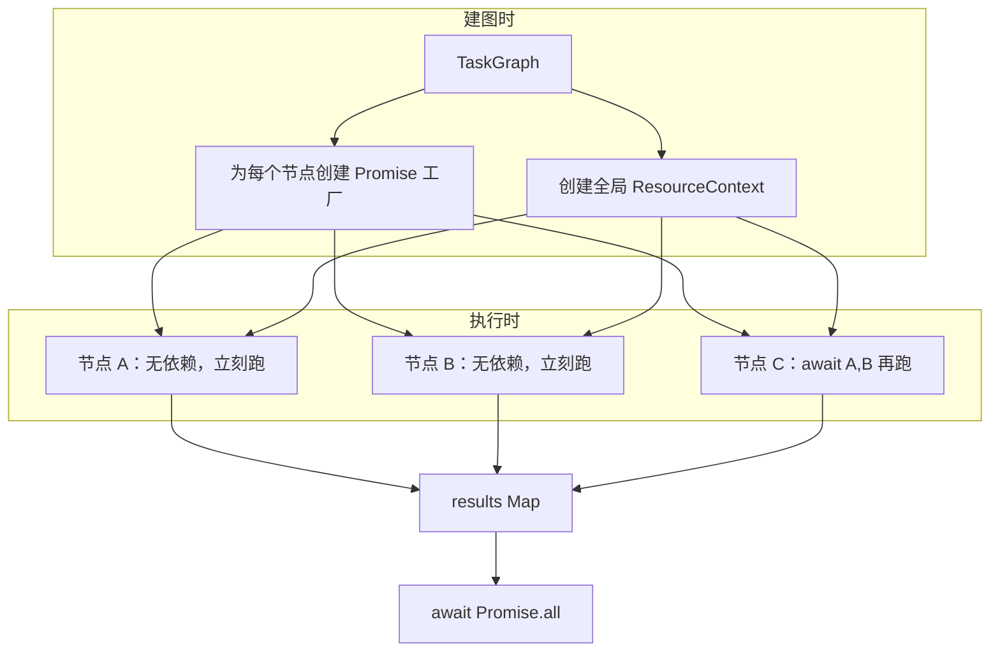

# DAG 调度演进：Promise 图 + 资源 Context

> 历史探索方案，未实施。当前行为以 `plan-dag-replan-on-failure.md` 和源码为准；资源锁方案已放弃。

## 背景

当前实现（`dag-scheduler.ts`）采用 **ready-set 轮询**：

```text
while (hasIncomplete || running > 0)
  → findReadyNodes()        // 每轮全图扫描
  → for ready: tryAcquire?  // 失败则 continue，试下一个
  → Promise.race(running)   // 等任一任务完成
```

能跑，但语义绕：

| 问题 | 表现 |
|------|------|
| 依赖等待 vs 资源等待混在一起 | `continue` 在 for 里是跳过节点，在 while 里是空转 |
| `tryAcquire` 非阻塞 | 抢不到锁靠调度器间接等，不是 `await` |
| 边界分支多 | `break` / 死锁 / 停滞（已改为立刻抛错） |
| `findReadyNodes` 每轮 O(n) | 小规模可接受，非必要复杂度 |

本文档整理 **Promise 图调度** 与 **全局资源 Context** 的演进方案，作为 `多agent-dag.md` 调度器章节的替代设计。

---

## 目标

1. **依赖等待**：有前驱 → `await` 前驱 Promise；无前驱 → 立刻执行
2. **资源等待**：读/写文件、命令互斥 → `await` 全局 ResourceContext，不轮询
3. **去掉** `while` + `findReadyNodes` + `tryAcquire` + `continue` 主路径
4. 保留：`maxParallel`、读写冲突规则、失败传播、动态 `write_file` 锁

---

## 方案总览



核心思想：**两种等待都变成 `await`**，不再靠调度循环猜状态。

| 等待类型 | 现在 | 演进后 |
|----------|------|--------|
| DAG 依赖 | `findReadyNodes` + 状态轮询 | `await Promise.all(dependsOn)` |
| 文件/命令锁 | `tryAcquire` + `continue` | `await resource.acquireRead(path)` |
| 并发上限 | `maxParallel` + `break` | `await semaphore.acquire()` |

---

## 一、节点 Promise 图

### 1.1 基本结构

```typescript
type NodeResult = {nodeId: string; output?: TaskOutput; error?: string};

async function runDag(graph: TaskGraph, context: DagRunContext): Promise<void> {
  const resourceCtx = createResourceContext();
  const semaphore = createSemaphore(options.maxParallel);
  const results = new Map<string, Promise<NodeResult>>();

  for (const node of graph.nodes.values()) {
    results.set(node.id, runNode(node, {
      graph,
      results,
      resourceCtx,
      semaphore,
      context
    }));
  }

  await Promise.all([...results.values()]);
}
```

### 1.2 单节点执行

```typescript
async function runNode(node: TaskNode, deps: NodeDeps): Promise<NodeResult> {
  try {
    // ① DAG 依赖：等前驱全部完成
    const predResults = await Promise.all(
      node.dependsOn.map((id) => deps.results.get(id)!)
    );

    // 前驱失败 → 当前 skip（不执行）
    const failed = predResults.find((r) => r.error);
    if (failed) {
      return {nodeId: node.id, error: '上游节点失败，已跳过'};
    }

    // ② 并发槽位
    await deps.semaphore.acquire();
    try {
      // ③ 资源锁（见第二节）
      const releases = await acquireNodeResources(node, deps.resourceCtx);
      try {
        const output = await executeNode(node, deps.context);
        return {nodeId: node.id, output};
      } finally {
        releases.forEach((r) => r());
      }
    } finally {
      deps.semaphore.release();
    }
  } catch (error) {
    return {nodeId: node.id, error: String(error)};
  }
}
```

### 1.3 启动时序示例

```text
edges: A → C, B → C, C → D

t=0  创建 A、B、C、D 四个 Promise（IIFE 立即启动）
t=0  A、B 无 dependsOn → 立刻进入 acquire + execute
t=*  C 在 await A、B 处挂起
t=*  A、B 完成后 C 继续
t=*  D 在 await C 处挂起，C 完成后 D 继续
```

**无依赖节点不会等调度器扫描**，创建即运行。

### 1.4 与 `findReadyNodes` 的对比

| | ready-set 轮询 | Promise 图 |
|--|----------------|------------|
| 就绪判断 | 每轮扫全图 `pending && preds done` | 前驱 Promise resolve 后自动继续 |
| 预计算 | 可选 in-degree 优化 | 不需要，依赖链自带顺序 |
| 代码入口 | `while` 循环 | `Promise.all` |
| 失败传播 | `skipDownstream` + `skipNodesWithBlockedPredecessors` | 前驱 `reject` / 返回 error，后继读结果后 skip |

---

## 二、全局 ResourceContext（Promise 等待）

### 2.1 动机

现在 `ResourceManager.tryAcquire()` 是 **非阻塞试探**：

```typescript
if (!resourceManager.tryAcquire(node)) {
  continue;  // for：试下一个节点；依赖调度器间接等待
}
```

演进为 **阻塞式队列**：抢不到就 `await`，占锁方 `release` 后唤醒下一个。

### 2.2 接口草案

```typescript
type ReleaseHandle = () => void;

type ResourceContext = {
  acquireRead(path: string): Promise<ReleaseHandle>;
  acquireWrite(path: string): Promise<ReleaseHandle>;
  acquireCommand(): Promise<ReleaseHandle>;
};

function createResourceContext(): ResourceContext;
```

节点侧用法：

```typescript
const releases: ReleaseHandle[] = [];
for (const p of node.resources.reads) releases.push(await ctx.acquireRead(p));
for (const p of node.resources.writes) releases.push(await ctx.acquireWrite(p));
if (node.resources.commands.length) releases.push(await ctx.acquireCommand());

try {
  return await executeNode(node);
} finally {
  releases.forEach((r) => r());
}
```

### 2.3 文件锁实现思路

**简单版（链式互斥）**：每个 path 一个 FIFO 队列，适合先落地。

```typescript
class PathLockQueue {
  private tail: Promise<void> = Promise.resolve();

  async acquire(): Promise<ReleaseHandle> {
    const prev = this.tail;
    let release!: () => void;
    this.tail = new Promise<void>((r) => { release = r; });
    await prev;
    return release;
  }
}
```

**完整版（读写锁）**：满足现有规则。

| 规则 | 实现 |
|------|------|
| 读-读 | 可并行，共享读计数 |
| 写-读、写-写 | 互斥，写等待所有读/写释放 |
| `run_cmd` | 全局命令互斥（同 cwd） |

与 `resource-manager.ts` 中 `claimsConflict` 语义对齐，只是把 `try` 改成 `await`。

### 2.4 动态写锁

Worker 运行时 `write_file` / `delete_file` / `run_cmd` 仍走同一 Context：

```typescript
// worker.ts beforeToolExecute
case 'write_file':
  await resourceCtx.acquireWrite(filePath);  // 挂起直到可用
  return true;
```

静态声明（Planner `reads/writes`）与动态申请共用一把锁表，避免两套逻辑分叉。

### 2.5 与节点 Promise 的关系

```text
runNode(node)
  ├── await deps.results[pred]     ← DAG 边
  ├── await semaphore.acquire()    ← 并发上限
  ├── await ctx.acquireWrite(p)  ← 资源边
  └── executeNode()
```

三种等待并列，都是 Promise，调度器不再承担「猜谁能跑」。

---

## 三、并发控制（maxParallel）

Promise 图默认会同时启动所有无依赖节点，需要信号量：

```typescript
class Semaphore {
  constructor(private max: number) {}

  async acquire(): Promise<void> { /* 满则 await */ }
  release(): void { /* 唤醒下一个 */ }
}
```

在 `runNode` 里，`await semaphore.acquire()` 放在 DAG 依赖之后、资源锁之前：

```text
等前驱 → 等槽位 → 等资源 → 执行 → 释放资源 → 释放槽位
```

---

## 四、失败与 Skip

### 4.1 节点失败

```typescript
// runNode 返回 { error } 而非 throw，避免整图 Promise.all 立刻 reject
const pred = await deps.results.get(predId)!;
if (pred.error) return { nodeId, error: '上游失败，已跳过' };
```

### 4.2 与现有逻辑对应

| 现在 | 演进后 |
|------|--------|
| `skipDownstream(failedId)` | 后继 `await` 到 failed 结果后主动 skip |
| `skipNodesWithBlockedPredecessors` | 可保留为防御，或并入 pred 检查 |
| `node.status = 'failed'/'skipped'` | 仍在 `executeNode` / 返回时写回 graph，供 UI `dag_snapshot` |

---

## 五、现状问题复盘（当前实现）

以下为 **v1 调度器**（`dag-scheduler.ts`）已识别的问题与修补，供迁移时对照。

### 5.1 `continue` 两层语义

```typescript
// for 里：跳过当前 ready 节点，试下一个
if (!tryAcquire(node)) continue;

// while 里（已删除）：空转 50 轮
stalemateRounds++; continue;
```

### 5.2 `running.size === 0` 三分支（已简化）

| 条件 | 行为 |
|------|------|
| `!hasIncomplete` | `break` 正常结束 |
| `ready=[]` 且有 pending | 死锁 throw |
| `ready>0` 且全抢不到锁 | 立刻 throw 资源阻塞 |

### 5.3 为何 `findReadyNodes` 不预排序

「就绪」是运行时状态（`pending` + 前驱 `done` + 锁 + 槽位），建图时只能预计算拓扑/in-degree，不能预计算 ready 集合。Promise 图用 `await` 前驱隐式表达这一约束。

---

## 六、迁移计划

### Phase 1：ResourceContext

- [ ] 新增 `resource-context.ts`（Promise 版读写锁 + 命令互斥）
- [ ] `worker.ts` 动态写走 `await acquire`
- [ ] 单测：两写互斥、两读并行、写等读释放

### Phase 2：Promise 调度器

- [ ] 新增 `dag-promise-scheduler.ts` 或替换 `runDag`
- [ ] `Semaphore` 实现 `maxParallel`
- [ ] 失败传播 + graph 状态回写 + `dag_snapshot` 事件

### Phase 3：收尾

- [ ] 删除 `findReadyNodes` 主路径依赖（可保留工具函数作测试）
- [ ] `多agent-dag.md` 调度器章节指向本文档
- [ ] 对比集成测试：并行 / 串行 / 资源冲突 / 失败 skip

---

## 七、风险与注意

| 风险 | 缓解 |
|------|------|
| 资源死锁（A 等 B 的文件，B 等 A 的文件） | Planner 静态校验 + 动态申请顺序一致 |
| `Promise.all` 遇 throw 整图中断 | 节点返回 `{error}`，不 throw |
| 内存：每节点常驻 Promise | 节点规模小（<50），可忽略 |
| UI 事件 `task_start` 时机 | 在 `acquire` 完成、即将 `execute` 时发 |

---

## 八、文件映射（预期）

| 现有 | 演进 |
|------|------|
| `dag-scheduler.ts` | `dag-promise-scheduler.ts` 或重写 |
| `resource-manager.ts` | `resource-context.ts`（Promise 版）；`tryAcquire` 可保留给测试对比 |
| `graph-utils.ts` | `findReadyNodes` 降级为测试/调试；保留 `detectCycle`、`skipDownstream` |
| `worker.ts` | `beforeToolExecute` 改 `await resourceCtx` |

---

## 参考

- 总体架构：`notes/多agent-dag.md`
- 记忆层：`BaseMemory` / `Blackboard`（`agent-memory.ts`）
- 当前实现：`packages/core/src/dag/dag-scheduler.ts`、`resource-manager.ts`
