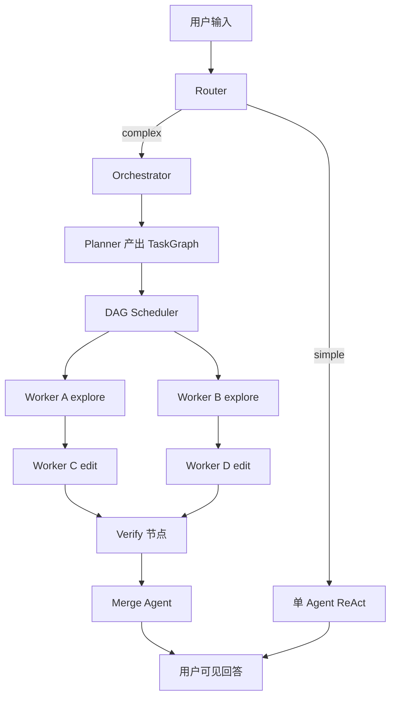

# 多 Agent + DAG 调度设计

> 历史设计记录，其中资源声明和 ResourceManager 未采用。当前实现以 `plan-dag-replan-on-failure.md` 和源码为准。

## 目标

在现有单 Agent（ReAct / ToT）基础上，演进为：

- **多 Agent**：Orchestrator 拆任务，Worker 执行，Merge 汇总
- **DAG 调度**：无依赖并行，有依赖串行，混排即 DAG
- **资源无冲突才并行**：同文件写-写、写-读互斥
- **简单任务短路**：小改动仍走单 Agent react，避免 DAG 开销

---

## 现状（已实现 / 待改）

### 已有

| 模块 | 文件 | 职责 |
|------|------|------|
| ReAct 执行器 | `react-agent.ts` | tool loop，可作为 Worker 内核 |
| 路由 | `router.ts` | react / tot 二选一 |
| Planner | `planner.ts` | 假设 + 验证计划（ToT） |
| Verify | `verify.ts` | 写文件后自动跑测试 |
| Session | `session.ts` | messages + InternalState |
| AiView | `state-ai-view.ts` | 增量 state 注入 LLM |
| 主入口 | `loop.ts` | `runAgentTurn` 单线执行 |

### 当前执行流

```text
用户输入
  → route（react / tot）
  → 单 CodeAgent.run()
  → VerifyCoordinator.judgeGate()
  → VerifyCoordinator.runFixLoop()（可选）
  → done
```

### 已完成的 State 分层

```text
InternalState（程序侧详细账本）
  visitedFiles / searchedTerms / writtenFiles / facts / ...
        ↓ project + diff
AiView（flushStateDelta → append [stateΔ] 到 messages 末尾）
        ↓
messages（LLM 实际看到的 transcript）
```

多 Agent 下：**每个 Worker 独立 InternalState + AiView**；Orchestrator 维护全局 Blackboard。

---

## 总体架构

```text
用户输入
   ↓
┌──────────────────┐
│  Router          │  simple → 单 Agent react（短路）
│                  │  complex → DAG orchestration
└────────┬─────────┘
         ↓
┌──────────────────┐
│  Orchestrator    │  拆任务、建 DAG、驱动调度、汇总
└────────┬─────────┘
         ↓
┌──────────────────┐
│  DAG Scheduler   │  就绪队列 + 并行度 + 资源锁
└────────┬─────────┘
         ↓
┌──────────────────┐
│  Worker Agents   │  每节点一个 ReActAgent 实例
└────────┬─────────┘
         ↓
┌──────────────────┐
│  ResourceManager │  文件锁、冲突检测
└──────────────────┘
```



---

## 核心数据模型

### TaskGraph

```typescript
type TaskNodeKind = 'explore' | 'edit' | 'verify' | 'merge';

type ResourceClaim = {
  reads: string[];   // 文件 path，相对 cwd
  writes: string[];  // 文件 path
  commands: string[]; // run_cmd 声明（同 cwd 默认互斥）
};

type TaskNode = {
  id: string;
  kind: TaskNodeKind;
  goal: string;                    // Worker 的自然语言目标
  inputs: Record<string, string>;  // 上游 nodeId → 输出 key
  resources: ResourceClaim;        // Planner 静态声明
  status: 'pending' | 'ready' | 'running' | 'done' | 'failed' | 'skipped';
  output?: TaskOutput;
  error?: string;
};

type TaskEdge = {
  from: string;
  to: string;
};

type TaskGraph = {
  nodes: Map<string, TaskNode>;
  edges: TaskEdge[];
};
```

### TaskOutput

```typescript
type TaskOutput = {
  summary: string;           // Worker 最终文本摘要
  operations: TurnOperations; // 本轮 write/delete/cmd
  facts: string[];           // Worker 确认的 facts
};
```

### Blackboard（Orchestrator 全局 InternalState）

```typescript
type Blackboard = {
  facts: string[];
  nodeOutputs: Map<string, TaskOutput>;
  // 全局资源追踪（比单 Worker 更全）
  visitedFiles: string[];
  searchedTerms: string[];
  writtenFiles: string[];
  deletedFiles: string[];
  executedCommands: string[];
  fileLocks: Map<string, string>; // path → nodeId
};
```

---

## DAG Scheduler

### 就绪条件

节点 `n` 可调度，当且仅当：

1. `n.status === 'pending'`
2. 所有 predecessor 均为 `done`
3. `ResourceManager.canAcquire(n.resources)` 为 true
4. `runningCount < maxParallel`

### 主循环（ready-set 并行）

```typescript
async function runDag(graph: TaskGraph, options: SchedulerOptions): Promise<void> {
  while (hasIncomplete(graph)) {
    const ready = findReadyNodes(graph);

    for (const node of ready) {
      if (running.size >= options.maxParallel) break;
      if (!resourceManager.tryAcquire(node)) continue;

      running.set(node.id, runWorker(node, blackboard));
    }

    if (running.size === 0 && ready.length === 0) {
      throw new Error('DAG deadlock or all blocked');
    }

    const {nodeId, result} = await Promise.race(running);
    running.delete(nodeId);
    resourceManager.release(nodeId);
    applyNodeResult(graph, nodeId, result);
  }
}
```

### 默认参数

| 参数 | 默认值 | 说明 |
|------|--------|------|
| `maxParallel` | 3 | 并发 Worker 上限 |
| `workerMaxSteps` | 20 | 单节点 ReAct 步数 |
| `failPolicy` | `skip_downstream` | 节点失败时下游 skip |
| `replanOnFail` | 1 | 整图 replan 次数上限 |

---

## 资源冲突规则

| 资源 | 冲突规则 |
|------|----------|
| 文件 path | 写-写、写-读 → 冲突；读-读 → 不冲突 |
| 目录 prefix | 可按 glob 前缀扩展（后续） |
| run_cmd | 同一 cwd 下默认互斥 |
| workspace cwd | `set_workspace` 节点互斥 |

### 两阶段检测

1. **静态（Planner 声明）**：建图时校验并行 edit 节点不写同一文件
2. **动态（运行时）**：Worker 实际 `write_file` 时向 ResourceManager 申请锁

### ResourceManager 接口

```typescript
type ResourceManager = {
  tryAcquire(node: TaskNode): boolean;
  release(nodeId: string): void;
  recordDynamicWrite(nodeId: string, path: string): boolean;
};
```

---

## Agent 角色划分

### Orchestrator

- 调用 Planner 产出 `TaskGraph`
- 驱动 Scheduler
- 维护 Blackboard
- 处理失败 / replan
- 向 UI 发送 `dag_snapshot`、`task_start`、`task_end` 事件

### Worker

- 每个 TaskNode 一个独立 `AgentSession`（独立 messages + InternalState + AiView）
- 内核：`CodeAgent extends ReActAgent`
- 启动时注入：
  - 节点 `goal`
  - 上游 `TaskOutput.summary`（一次性 system note，非全量 Blackboard）
- 结束时产出 `TaskOutput`，写入 Blackboard

```typescript
async function runWorker(node: TaskNode, blackboard: Blackboard): Promise<TaskOutput> {
  const session = createWorkerSession(node, blackboard);
  const agent = new CodeAgent(session.options, session);

  session.appendUser(buildWorkerPrompt(node, blackboard));
  const result = await agent.run();

  return {
    summary: session.extractLastAssistantText(),
    operations: session.refreshOperations(),
    facts: [...session.state.facts]
  };
}
```

### Merge Agent

- 读各 Worker 的 `TaskOutput.summary`
- 不拼接原始 tool messages
- 生成用户可见的最终回答

### Verify 节点

- 复用现有 `verify.ts` 逻辑
- 作为 DAG 中 `kind: 'verify'` 的节点
- 依赖所有相关 `edit` 节点完成后触发

---

## Planner 产出 DAG

### 路径 A：LLM 直接输出 DAG JSON（推荐先做）

扩展 `planSchema`：

```typescript
const dagPlanSchema = z.object({
  summary: z.string(),
  tasks: z.array(z.object({
    id: z.string(),
    kind: z.enum(['explore', 'edit', 'verify', 'merge']),
    goal: z.string(),
    dependsOn: z.array(z.string()),
    reads: z.array(z.string()),
    writes: z.array(z.string())
  }))
});
```

Prompt 约束：

- 每个 `edit` 必须有 `explore` 前置（或声明 `reads`）
- 同一 `writes` 的文件不能出现在无依赖关系的并行节点
- `verify` 必须在相关 `edit` 之后
- 启动前 DFS 环检测

### 路径 B：规则 + LLM 混合

LLM 输出步骤列表；Orchestrator 用规则补依赖（如「改文件 X」自动依赖「读文件 X」）。

---

## Router 三路决策

在现有 `react | tot` 基础上扩展：

| 路由结果 | 条件 | 行为 |
|----------|------|------|
| `react` | 明确小任务 | 现有单 Agent |
| `tot` | 需规划但可单 Worker | 现有 ToT loop（过渡） |
| `dag` | 多模块、可并行探索 | 走 Orchestrator |

```typescript
type ReasoningRoute = {
  mode: 'react' | 'tot' | 'dag';
  confidence: number;
  reason: string;
};
```

---

## State / Context 策略（与 AiView 对齐）

### 三层上下文

```text
L0 Frozen Prefix   system prompt、tools schema、工作区
L1 Append-only     user / assistant / tool transcript + [plan] + [stateΔ]
L2 Volatile Suffix  （可选）当前步极短 hint，一般不需要
```

### 多 Agent 下

| 组件 | InternalState | AiView | messages |
|------|---------------|--------|----------|
| Orchestrator | Blackboard 最全 | 不直接调 LLM | 用户对话 |
| Worker | 本节点详细 | 增量 append | 本节点 transcript |
| Merge | 无 | 无 | 仅各 Worker summary |

Worker **不**接收 Orchestrator 全量 `visitedFiles`，只接收：

```text
[upstream]
节点 A：已读 auth.ts、routes.ts，结论：JWT 在 verifyToken()
节点 B：已搜 "jwt secret"，结论：secret 来自 env

[本节点目标]
实现 middleware，参考上游结论...
```

---

## 与现有文件的映射

| 现有 | 改造 |
|------|------|
| `loop.ts` | 增加 `runDagTurn`，保留 `runAgentTurn` |
| `router.ts` | 增加 `dag` 模式 |
| `planner.ts` | 增加 `llmPlanDag` 产出 TaskGraph |
| `planner-schemas.ts` | 增加 `dagPlanSchema` |
| `react-agent.ts` | 不变，Worker 复用 |
| `session.ts` | Worker 工厂 `createWorkerSession` |
| `state-ai-view.ts` | Worker 各自独立 AiView |
| `verify.ts` | 抽成 verify 节点执行器 |
| `session-types.ts` | 增加 TaskGraph / Blackboard 类型 |
| **新增** `orchestrator.ts` | 编排入口 |
| **新增** `dag-scheduler.ts` | 调度循环 |
| **新增** `resource-manager.ts` | 文件锁 |
| **新增** `worker.ts` | Worker 封装 |

---

## UI 事件扩展

```typescript
type AgentEvent =
  | /* 现有 */
  | {type: 'dag_snapshot'; graph: SerializedTaskGraph}
  | {type: 'task_start'; nodeId: string; kind: TaskNodeKind}
  | {type: 'task_end'; nodeId: string; output?: TaskOutput; error?: string};
```

---

## 实现阶段

### Phase 1：调度器骨架（无 LLM）

- [ ] `TaskGraph` / `TaskNode` 类型
- [ ] `dag-scheduler.ts`：mock Worker（固定 delay + 假 output）
- [ ] 单元测试：并行 / 串行 / join 节点

### Phase 2：ResourceManager

- [ ] 文件 path 读写冲突矩阵
- [ ] `tryAcquire` / `release`
- [ ] 测试：两 explore 读同文件并行 OK；两 edit 写同文件串行

### Phase 3：Worker 隔离

- [ ] `createWorkerSession`
- [ ] `runWorker` 封装现有 ReActAgent
- [ ] 上游 summary 注入

### Phase 4：Planner 产出 DAG

- [ ] `dagPlanSchema` + prompt
- [ ] 环检测
- [ ] Orchestrator 串联 Planner → Scheduler

### Phase 5：Router + 短路

- [ ] Router 增加 `dag`
- [ ] 简单任务仍走 `react`

### Phase 6：Verify / Merge 节点

- [ ] verify 作为 DAG 节点
- [ ] Merge Agent 汇总

### Phase 7：UI

- [ ] DAG 快照展示
- [ ] 节点状态（pending / running / done / failed）

---

## 失败策略

| 场景 | 行为 |
|------|------|
| Worker 超时 | 节点 `failed`，释放锁 |
| Worker max_steps | 节点 `failed` |
| 节点 failed | 下游 `skipped`（默认） |
| 关键节点 failed | 触发 Orchestrator replan（最多 N 次） |
| 环图 | Planner 校验拒绝；Scheduler 启动前 DFS |
| 死锁（全 blocked） | 抛错 + UI 展示 blocked 原因 |

---

## 边缘情况

| 场景 | 期望 |
|------|------|
| 两 explore 读同一文件 | 并行 |
| 两 edit 写同一文件 | 串行或 Planner 禁止并行 |
| A→C, B→C，A 失败 | C skip 或 replan |
| 空 DAG / 单节点 | 退化为 react |
| Worker 动态 write 未声明文件 | ResourceManager 动态拦截 |
| 跨 turn 复用 Blackboard | facts 保留；fileLocks 清空 |

---

## 测试计划

### 调度器单元测试

```text
graph: A → C, B → C（A/B 无依赖）
期望：A、B 并行启动，C 等两者 done
```

```text
graph: A → B → C
期望：严格串行
```

### 资源冲突测试

```text
node1 writes foo.ts, node2 writes foo.ts，无依赖
期望：第二个等第一个 release 后才 acquire
```

### 集成测试

```text
用户：「给 API 加 JWT 并写测试」
期望 DAG：explore auth + explore tests → edit middleware + edit tests → verify → merge
```

---

## 设计决策备忘

1. **节点粒度**：一个节点 = 一个子目标，不是一个 tool call
2. **并行上限**：默认 3
3. **Worker 不共享 session**：避免 messages 竞态
4. **Blackboard 是程序内存**：不全文塞 prompt
5. **简单任务短路**：保留 react 路径
6. **State 已分层**：Worker 沿用 InternalState + AiView 增量注入

---

## 参考：单 Agent vs 多 Agent 对比

| | 单 Agent（现在） | 多 Agent DAG |
|---|------------------|--------------|
| 规划 | ToT hypotheses | TaskGraph |
| 执行 | 单 ReAct loop | 多 Worker 并行/串行 |
| State | 单 InternalState | Blackboard + 每 Worker InternalState |
| LLM 上下文 | 单 messages | 每 Worker 独立 messages |
| 验证 | turn 末尾 verify | verify 节点 |
| 适用 | 小任务、单路径 | 多模块、可并行探索 |
